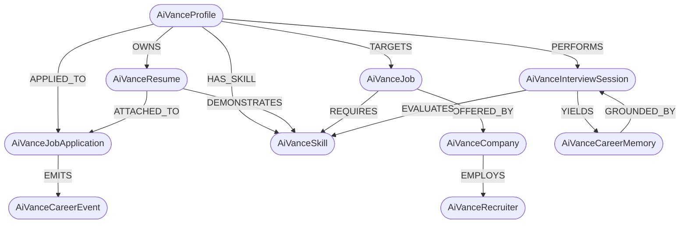

# AiVance Career Schema Standard

This directory contains the canonical language-agnostic **Open Career Knowledge Schema Suite** (Draft 2020-12 / JSON Schema) for AiVance.

---

## 1. Overview & Architectural Vision

As AiVance transitions into an open-source **Career Knowledge OS**, standardizing data definitions across diverse environments is paramount. This schema repository serves as the single source of truth (SSOT) across all AiVance platforms, clients, and decentralized community tools:

* **Android Native Client** (`:core:common:model`, `:core:database`, Kotlin Multiplatform)
* **Web Client** (`clients/web`, React / TypeScript)
* **Browser Extension** (`clients/browser`, Chromium Manifest V3)
* **Terminal CLI** (`clients/cli`, Node / Kotlin Native headless automations)
* **Event-Driven State Engine** (`:core:events`, Reactive Career Event Bus)
* **Temporal Memory & Audit Engine** (`:core:memory`, Longitudinal Career Memory)

All schemas strictly adhere to [JSON Schema Draft 2020-12](https://json-schema.org/draft/2020-12/schema) specification.

---

## 2. Complete Schema Catalog

| Schema File | Dialect / Version | Schema Title | Canonical `$id` | Description |
| :--- | :--- | :--- | :--- | :--- |
| [`profile.schema.json`](./profile.schema.json) | Draft 2020-12 | `AiVanceProfile` | `https://schema.aivance.org/v2/profile.schema.json` | Candidate identity, headline, compensation expectations, work preferences, immigration/visa rights, and notice period. |
| [`skill.schema.json`](./skill.schema.json) | Draft 2020-12 | `AiVanceSkill` | `https://schema.aivance.org/v2/skill.schema.json` | Skill taxonomy taxonomy, classification category, proficiency level, verified status, and linked empirical evidence. |
| [`resume.schema.json`](./resume.schema.json) | Draft 2020-12 | `AiVanceResume` | `https://schema.aivance.org/v2/resume.schema.json` | Master resume document metadata, tailored role versions, standardized sections, bullet points, and achievements. |
| [`job.schema.json`](./job.schema.json) | Draft 2020-12 | `AiVanceJob` | `https://schema.aivance.org/v2/job.schema.json` | Job posting specification, company data, compensation range, remote-work policy, employment types, and requirements. |
| [`company.schema.json`](./company.schema.json) | Draft 2020-12 | `AiVanceCompany` | `https://schema.aivance.org/v2/company.schema.json` | Company catalog entity, domain, industry, workforce size, headquarters, remote culture, social links, and tech stack tags. |
| [`recruiter.schema.json`](./recruiter.schema.json) | Draft 2020-12 | `AiVanceRecruiter` | `https://schema.aivance.org/v2/recruiter.schema.json` | Talent acquisition contact, associated company, title, LinkedIn, and confidence-scored verified contact channels. |
| [`application.schema.json`](./application.schema.json) | Draft 2020-12 | `AiVanceJobApplication` | `https://schema.aivance.org/v2/application.schema.json` | Tracked job application lifecycle, pipeline stage progression, linked resume/cover letter, timeline history, and follow-up tasks. |
| [`interview.schema.json`](./interview.schema.json) | Draft 2020-12 | `AiVanceInterviewSession` | `https://schema.aivance.org/v2/interview.schema.json` | Practice & real interview sessions, questions, multi-dimensional evaluation rubrics (clarity, accuracy, tone, STAR method), and feedback summaries. |
| [`career-event.schema.json`](./career-event.schema.json) | Draft 2020-12 | `AiVanceCareerEvent` | `https://schema.aivance.org/v2/career-event.schema.json` | Reactive event bus envelope for asynchronous state propagation (`eventId`, `eventType`, `timestamp`, `sourceModule`, `correlationId`, `payload`). |
| [`career-memory.schema.json`](./career-memory.schema.json) | Draft 2020-12 | `AiVanceCareerMemory` | `https://schema.aivance.org/v2/career-memory.schema.json` | Longitudinal career memory entry tracking historical skill evolution, interview performance, strengths, weaknesses, metrics, and grounding references. |
| [`career-graph.schema.json`](./career-graph.schema.json) | Draft 2020-12 | `AiVanceCareerGraph` | `https://schema.aivance.org/v2/career-graph.schema.json` | Unified career knowledge graph structure connecting entities as nodes and typed relationships as weighted edges. |

---

## 3. Schema Structure & Key Definitions

### 1. `profile.schema.json`
* **Root Type**: `object`
* **Required Properties**: `["id", "fullName", "email", "targetRole", "workPreference", "salaryExpectation", "visaStatus", "noticePeriod"]`
* **Key Enums**:
  * `workPreference`: `["REMOTE", "HYBRID", "ONSITE"]`
  * `salaryExpectation.period`: `["HOURLY", "MONTHLY", "ANNUALLY"]`
  * `noticePeriod.periodType`: `["IMMEDIATE", "WEEKS_2", "MONTH_1", "MONTHS_2", "MONTHS_3", "CUSTOM"]`

### 2. `skill.schema.json`
* **Root Type**: `object`
* **Required Properties**: `["id", "name", "category", "proficiency", "yearsOfExperience", "isVerified", "evidenceIds"]`
* **Key Enums**:
  * `category`: `["TECHNICAL", "SOFT", "DOMAIN", "TOOL"]`
  * `proficiency`: `["BEGINNER", "INTERMEDIATE", "ADVANCED", "EXPERT"]`
  * `verificationMethod`: `["SELF_ATTESTED", "ASSESSMENT", "PROJECT_EVIDENCE", "INTERVIEW_BENCHMARK", "ENDORSEMENT"]`

### 3. `resume.schema.json`
* **Root Type**: `object`
* **Required Properties**: `["id", "userId", "title", "versions"]`
* **Sub-definitions**:
  * `ResumeVersion`: `id`, `versionName`, `templateId`, `targetRole`, `targetJobId`, `sections`
  * `ResumeSection`: `id`, `sectionType`, `title`, `sectionOrder`, `content`, `items`
  * `ResumeItem`: `id`, `title`, `organization`, `location`, `startDate`, `endDate`, `isCurrent`, `bulletPoints`, `achievements`, `skills`, `url`
* **Key Enums**:
  * `sectionType`: `["SUMMARY", "EXPERIENCE", "EDUCATION", "SKILLS", "PROJECTS", "CERTIFICATIONS", "AWARDS", "PUBLICATIONS", "VOLUNTEERING", "CUSTOM"]`

### 4. `job.schema.json`
* **Root Type**: `object`
* **Required Properties**: `["id", "title", "company", "remotePolicy", "employmentType", "description", "sourceProvider"]`
* **Key Enums**:
  * `remotePolicy`: `["FULLY_REMOTE", "REMOTE_FIRST", "REMOTE_FRIENDLY", "HYBRID", "ON_SITE", "UNKNOWN"]`
  * `employmentType`: `["FULL_TIME", "PART_TIME", "CONTRACT", "INTERNSHIP", "APPRENTICESHIP", "TEMPORARY", "FREELANCE", "OTHER"]`
  * `experienceLevel`: `["ENTRY_LEVEL", "MID_LEVEL", "SENIOR_LEVEL", "EXECUTIVE", "NOT_SPECIFIED"]`
  * `compensation.interval`: `["HOURLY", "DAILY", "WEEKLY", "MONTHLY", "ANNUALLY"]`

### 5. `company.schema.json`
* **Root Type**: `object`
* **Required Properties**: `["id", "name", "domain", "industry", "remoteCulture"]`
* **Key Enums**:
  * `size`: `["SIZE_1_10", "SIZE_11_50", "SIZE_51_200", "SIZE_201_500", "SIZE_501_1000", "SIZE_1001_5000", "SIZE_5001_10000", "SIZE_10000_PLUS"]`
  * `remoteCulture.policy`: `["FULLY_REMOTE", "REMOTE_FIRST", "REMOTE_FRIENDLY", "HYBRID", "ON_SITE", "UNKNOWN"]`

### 6. `recruiter.schema.json`
* **Root Type**: `object`
* **Required Properties**: `["id", "companyId", "name", "title", "verifiedContacts"]`
* **Sub-definitions**:
  * `RecruiterContactChannel`: `id`, `type`, `value`, `confidenceScore` (0-100), `verificationMethod`, `isVerified`, `lastVerifiedAt`
* **Key Enums**:
  * `type`: `["EMAIL", "PHONE", "LINKEDIN_INMAIL", "TWITTER_DM"]`
  * `verificationMethod`: `["SMTP_HANDSHAKE", "MX_RECORD", "PATTERN_SYNTHESIS", "INBOX_SCRAPE", "MANUAL_VERIFIED", "THIRD_PARTY_ENRICHMENT"]`

### 7. `application.schema.json`
* **Root Type**: `object`
* **Required Properties**: `["id", "jobId", "stage", "timeline", "tasks"]`
* **Sub-definitions**:
  * `ApplicationTimelineEvent`: `id`, `stage`, `title`, `timestamp`, `notes`, `actor` (`["USER", "AUTOMATION", "RECRUITER"]`)
  * `ApplicationTask`: `id`, `title`, `dueDate`, `isCompleted`, `priority` (`["LOW", "MEDIUM", "HIGH", "URGENT"]`), `taskType`
* **Key Enums**:
  * `stage`: `["SAVED", "APPLIED", "SCREENING", "TECHNICAL_ROUND", "ONSITE", "OFFER", "REJECTED", "WITHDRAWN"]`

### 8. `interview.schema.json`
* **Root Type**: `object`
* **Required Properties**: `["id", "role", "company", "difficulty", "type", "questions", "feedbackSummary"]`
* **Sub-definitions**:
  * `InterviewQuestionItem`: `id`, `order`, `questionText`, `category`, `difficulty`, `expectedKeyPoints`, `idealAnswer`, `userAnswer`, `audioRecordingUrl`, `evaluation`
  * `QuestionRubricEvaluation`: `clarity` (0-100), `accuracy` (0-100), `tone` (0-100), `starMethodScore` (0-100 or null), `overallScore` (0-100), `feedback`, `keyStrengths`, `improvementTips`
  * `InterviewFeedbackSummary`: `overallScore` (0-100), `readinessRecommendation` (`["NOT_READY", "NEEDS_PRACTICE", "COMPETITIVE", "HIGHLY_RECOMMENDED"]`), `strengths`, `weaknesses`, `actionItems`, `detailedAnalysis`
* **Key Enums**:
  * `difficulty`: `["EASY", "MEDIUM", "HARD"]`
  * `type`: `["BEHAVIORAL", "SYSTEM_DESIGN", "CODING", "HIRING_MANAGER"]`

### 9. `career-event.schema.json`
* **Root Type**: `object`
* **Required Properties**: `["eventId", "eventType", "timestamp", "sourceModule", "correlationId", "payload"]`
* **Purpose**: Primary envelope for the AiVance Reactive Career Event Bus (`:core:events`), eliminating repository polling and notifying state subscribers.
* **Topics**: `profile.updated`, `resume.version_created`, `resume.ats_analyzed`, `job.saved`, `job.status_changed`, `application.stage_transitioned`, `interview.session_completed`, `skill.verified`, `memory.entry_recorded`.

### 10. `career-memory.schema.json`
* **Root Type**: `object`
* **Required Properties**: `["id", "timestamp", "category", "evidenceType", "strengths", "weaknesses", "metrics", "groundingReferences"]`
* **Sub-definitions**:
  * `GroundingReference`: `id`, `sourceUri`, `sourceType`, `quote`, `confidence`
* **Key Enums**:
  * `category`: `["INTERVIEW_PERFORMANCE", "RESUME_FEEDBACK", "SKILL_ACQUISITION", "APPLICATION_OUTCOME", "CAREER_MILESTONE", "GOAL_PROGRESS"]`
  * `evidenceType`: `["TRANSCRIPT_SNIPPET", "ATS_AUDIT_LOG", "ASSESSMENT_RESULT", "APPLICATION_DECISION", "CODE_COMMITS", "EXTERNAL_REFERENCE"]`
  * `retentionPolicy`: `["EPHEMERAL_30D", "LONGITUDINAL_1Y", "PERMANENT"]`

---

## 4. Graph Ontology & System Interoperability



---

## 5. Schema Validation

### Running the Built-in Test Harness
The schema repository includes an automated validator script that inspects all JSON schemas against Draft 2020-12 requirements:

```bash
# Run validation from repository root
python career-schema/validate_schemas.py
```

### Validating with Node.js / Ajv CLI
```bash
npx ajv-cli compile \
  --spec=draft2020 \
  -s "career-schema/*.schema.json"
```

### Validating an Entity Payload (Python)
```python
import json
from jsonschema import validate, Draft202012Validator

with open("career-schema/profile.schema.json") as sf:
    schema = json.load(sf)

with open("sample-candidate.json") as df:
    payload = json.load(df)

Draft202012Validator(schema).validate(payload)
print("Payload successfully validated!")
```

---

## 6. Code Generation Across Multiplatform Clients

To generate strongly-typed language bindings from these schemas:

### Kotlin (`kotlinx.serialization` for Android / KMP)
```bash
./gradlew generateCareerSchemaKotlin
```

### TypeScript (`quicktype` for Web & Browser Extension)
```bash
npx quicktype \
  --src-lang schema \
  --src "career-schema/*.schema.json" \
  --out clients/web/src/types/career-schema.ts \
  --lang ts
```

### Python (Pydantic v2 for AI Runtimes & Eval Suites)
```bash
datamodel-codegen \
  --input career-schema/ \
  --input-file-type jsonschema \
  --output evaluation/models/career_schema.py \
  --output-model-type pydantic_v2.BaseModel
```
