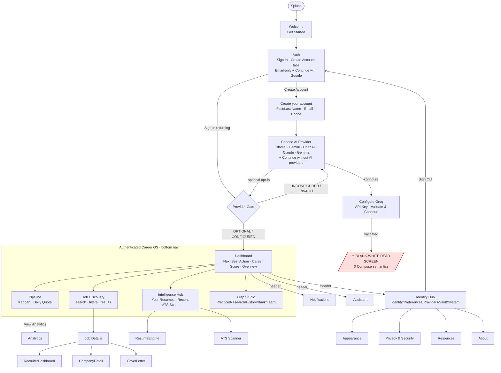

# LIVE PRODUCT SURFACE MAP — GATE A

> **Scope:** Runtime-only traversal of the *shipping APK* on an emulator. This is a
> record of **observed product behavior**, not an internal-architecture audit
> (that is Gate B/C). No production code was changed to produce this report.

## Run Context

| Field | Value |
| :--- | :--- |
| Date | 2026-09-25 |
| App ID | `com.bangersoul.aivance.debug` |
| Version | `1.0.0-debug` (versionCode 1) · in-app label `AiVance v2.0.0 (BETA)` |
| Launcher activity | `com.bangersoul.aivance.MainActivity` (single-activity, Compose) |
| APK under test | `app/build/outputs/apk/debug/app-x86_64-debug.apk` (md5 `37853809fe32658fe34a4b27abb7791d`) |
| Device | AVD `m06_test` · `emulator-5554` · Android 14 / API 34 / x86_64 · 1080×2340 |
| Launch | `adb shell monkey -p com.bangersoul.aivance.debug -c android.intent.category.LAUNCHER 1` |
| Baseline | `pm clear` for a cold first-run, then full onboarding traversal |

Product entry is governed by a **provider gate** (`ProviderGateState`): `OPTIONAL`
(explicit "Continue without AI providers") and `CONFIGURED` may enter; `UNCONFIGURED`
/ `INVALID` are held on provider setup. Provider-optional is a supported contract —
confirmed at runtime by reaching a fully functional Dashboard with no AI provider.

---

## Navigation Graph (observed)



---

## Feature Matrix

### Entry & Onboarding

| Screen | Key elements observed | State | Evidence |
| :--- | :--- | :--- | :--- |
| Welcome | `✦ AiVance`, "AI Powered Career Operating System", 6 feature bullets, **Get Started** | ✅ Works | `01_welcome.png` |
| Auth | Tabs *Sign In* / *Create Account*, **Email** (no password), Continue, Continue with Google, Back | ✅ Works | `02_auth.png` |
| Create your account | First Name, Last Name, Email, Phone (optional), Continue | ✅ Works | `04_create_account.png`, `18_*.png` |
| Choose AI Provider | Ollama (Local), Google Gemini, OpenAI, Anthropic Claude, Gemma (On-device), **Continue without AI providers** | ✅ Works | `03_provider_setup.png` |
| Configure Groq | API Key field, Validate & Continue, Back | ⚠️ Reachable via unexpected route; validate → dead screen | `05_configure_groq.png`, `16_post_groq.png` |
| Choose Job Provider | Naukri, USAJobs, Greenhouse, LinkedIn (via Apify), Lever, RemoteOK, Continue without | ✅ Works | `06_job_provider.png` |
| Configure RemoteOK | (validates with empty key — no field) | ✅ Works | `07_configure_remoteok.png` |
| Enrichment (Optional) | Hunter.io, **Skip for now** | ✅ Works | `08_enrichment.png` |

### Authenticated Career OS — Primary Tabs (bottom nav: Dashboard · Intelligence · Discovery · Pipeline · Prep Studio)

| Tab | Key elements observed | State | Evidence |
| :--- | :--- | :--- | :--- |
| **Dashboard** | Next Best Action → *Upload Resume*; Career Score ("Unlock your score", Not scored yet); Overview cards ATS Score / Active Apps / Saved Jobs (all 0); header actions Notifications, Profile, AI Assistant | ✅ Works | `20_dashboard.png`, `99_final_dashboard.png` |
| **Intelligence Hub** | Your Resumes ("No resumes yet"), Recent ATS Scans ("No ATS scans yet"), + import affordance | ✅ Works (empty) | `tab_Intelligence.png` |
| **Job Discovery** | Search field, filter row (Country/State/City/Workplace/Type/Experience/Remote policy/Tech stack), sort ("Best match"); search "android" → **"No matches found"** empty state + Refresh | ✅ Works (empty result) | `tab_Discovery.png`, `tab_Discovery_search.png` |
| **Pipeline** | Pipeline Performance hero, **View Analytics**, Daily Application Quota (0 of 5, Edit cap), Kanban Board (Saved 0 / Preparing / …), "No applications" empty | ✅ Works (empty) | `tab_Pipeline.png` |
| **Prep Studio** | Sub-tabs Practice / Research / History / Question Bank / Learn; Interview Readiness; Quick Practice; Custom Mock Session → Configure Session | ✅ Works | `tab_PrepStudio.png` |

### Secondary & System Screens

| Screen | Entry | Key elements | State | Evidence |
| :--- | :--- | :--- | :--- | :--- |
| Assistant | Dashboard header | "Good Morning", provider·Ready chip, Career Snapshot, Quick Commands (Optimize Resume / Find Jobs), Suggested Advice | ✅ Works | `sec_Assistant.png` |
| Notifications | Dashboard header | "0 unread", "No notifications yet" | ✅ Works (empty) | `sec_Notifications.png` |
| Analytics | Pipeline → View Analytics | Sub-tabs Health / Trends / Simulator; Hireability Score; Interview Chance 0% / Offer Chance 0%; Health Dimensions | ✅ Works | `sec_Analytics.png` |
| Identity Hub | Dashboard header (Profile) | 5 sub-tabs: **Identity / Preferences / Providers / Vault / System** | ✅ Works | `sec_IdentityHub.png` |
| ↳ Identity | IdentityHub tab | Personal Information (Full Name / Email / Phone = "Not provided"), Professional Experience | ✅ Works | — |
| ↳ Providers | IdentityHub tab | Provider Center: Naukri HEALTHY; USAJobs / Ollama / Greenhouse UNHEALTHY | ✅ Works | — |
| ↳ Vault | IdentityHub tab | Document Vault ("No documents found", Upload Document) | ✅ Works (empty) | — |
| ↳ System | IdentityHub tab | System Controls (Appearance, Privacy & Security, Remote Work Resources, About), Data Management (Export / Reset), Sign Out, "AiVance v2.0.0 (BETA)" | ✅ Works | — |
| Appearance | System → Appearance & Theme | Theme Mode (Follow System / Light / Dark / AMOLED), Accent Color (Material You) | ✅ Works | `sys_Appearance.png` |
| Privacy & Security | System → Privacy & Security | Renders header only; **no exposed content semantics** | ⚠️ Near-blank | `sys_Privacy.png` |
| Resources | System → Remote Work Resources | (opened) | ✅ Reachable | `sys_Resources.png` |
| About | System → About AiVance | (opened) | ✅ Reachable | `sys_About.png` |

### Deeper screens present in the graph but not exercised this run
`Job Details → Recruiter Discovery / Company Detail / Cover Letter`, `Resume Engine`,
`ATS Scanner`, `Resume Detail`, `Saved Jobs`, `Job Comparison`, `Provider Management`
(distinct from IdentityHub/Providers). Reachable per `AivanceNavGraph.kt`; require seeded
job/resume data to enter.

---

## Runtime Findings

1. **⚠️ Blank-white dead screen after Groq validation.** Path
   `ProviderSetup → "Continue without AI providers" → Configure Groq → paste valid key →
   Validate & Continue` advances to a screen that renders **pure white with zero Compose
   semantics** — `uiautomator dump` returns only the bare `AndroidComposeView` frame
   (3492 bytes, no text/content-desc nodes) across repeated waits; pixel analysis shows
   only the status bar (y 53–88) and system nav bar (y 2251–2297) with a fully white body.
   The process is **alive** (no FATAL, empty crash buffer, GC + metrics logging normal).
   This is a navigation dead-end / rendering failure, not a crash. Evidence:
   `16_post_groq.png`, `17_after_validate.png`.

2. **⚠️ Unexpected "Configure Groq" routing.** Tapping **Continue without AI providers**
   on Choose AI Provider sometimes lands on **Configure Groq** rather than proceeding as
   provider-optional. Groq is *not* one of the listed providers on that screen, so this
   route is surprising. The clean provider-optional path (Create Account → Continue without
   AI providers) instead reaches Dashboard correctly.

3. **⚠️ Privacy & Security screen near-blank.** `System → Privacy & Security` renders a
   header band only, with no exposed content text nodes (`sys_Privacy.png`). Same
   Compose-semantics gap symptom as finding #1, milder.

4. **⚠️ IdentityHub "Preferences" tab shows Provider Center.** The Preferences sub-tab
   and the Providers sub-tab render **identical** content (Provider Center list) — the
   Preferences tab appears mis-wired to the Providers destination.

5. **ℹ️ Onboarding email field retains a stray trailing char.** The Email field held
   `newtester@example.comy` after editing; a trailing character survived clearing. Partly
   an `adb input text` harness artifact, but the field did not fully reset on re-entry.
   Did not block progression through Create Account.

6. **✅ Process death & relaunch persists session.** `am force-stop` then relaunch returns
   directly to **Dashboard** (no re-onboarding) — the provider gate + auth state rehydrate
   from persisted DataStore. Confirmed on task `t41`.

7. **✅ System back navigation is correct.** `Analytics → back → Pipeline → back →
   Dashboard root`; the workflow back handler collapses secondary screens onto their
   workspace, then non-Dashboard workspaces onto Dashboard, as designed.

8. **✅ Empty states are graceful throughout.** Intelligence ("No resumes yet"), Discovery
   ("No matches found" + Refresh), Pipeline ("No applications"), Notifications, and Vault
   all present intentional empty states rather than blank/error surfaces.

---

## Evidence Index (`docs/evidence/R2/`)

| File | Surface |
| :--- | :--- |
| `01_welcome.png` | Welcome |
| `02_auth.png` | Auth |
| `03_provider_setup.png` | Choose AI Provider |
| `04_create_account.png`, `04b_form_filled.png`, `18_after_createacct_continue.png` | Create account form |
| `05_configure_groq.png`, `16_post_groq.png`, `17_after_validate.png` | Groq config + blank-white dead screen |
| `06_job_provider.png`, `07_configure_remoteok.png` | Job provider selection/config |
| `08_enrichment.png` | Enrichment (optional) |
| `09_post_onboarding_returned_to_auth.png`, `10–14_*.png`, `15_current.png` | Earlier auth-loop / blank-screen investigation |
| `20_dashboard.png`, `99_final_dashboard.png` | Dashboard |
| `tab_Intelligence.png`, `tab_Discovery.png`, `tab_Discovery_search.png`, `tab_Pipeline.png`, `tab_PrepStudio.png` | Primary tabs |
| `sec_Assistant.png`, `sec_Notifications.png`, `sec_Analytics.png`, `sec_IdentityHub.png` | Secondary screens |
| `sys_Appearance.png`, `sys_Privacy.png`, `sys_Resources.png`, `sys_About.png` | System settings |

---

## GATE A — COMPLETE

Full runtime surface mapped: entry → onboarding → provider gate → Dashboard → all 5
primary tabs → secondary (Assistant, Notifications, Analytics) → Identity Hub (5 sub-tabs)
→ system settings → back navigation → process death + relaunch. Four ⚠️ runtime issues and
one ℹ️ note recorded above; no production code changed. Deeper detail screens (Job Details
subtree, Resume/ATS engines, Saved Jobs) are graph-present but need seeded data.
```

```
════════════════════════════════════════════════════════════════════
 LIVE TEST HANDOFF
════════════════════════════════════════════════════════════════════
 Emulator : emulator-5554 (AVD m06_test, API 34 x86_64, 1080×2340) — RUNNING
 App      : com.bangersoul.aivance.debug (MainActivity, task t41) — FOREGROUND
 Screen   : DASHBOARD (authenticated, provider-optional session)
 Account  : Test User / newtester@example.com (created this run)
 Data     : Empty baseline — 0 resumes, 0 apps, 0 saved jobs, 0 notifications

 RELAUNCH : adb -s emulator-5554 shell monkey -p com.bangersoul.aivance.debug \
            -c android.intent.category.LAUNCHER 1
 UI DUMP  : adb -s emulator-5554 shell 'uiautomator dump //sdcard/w.xml >/dev/null 2>&1'
            adb -s emulator-5554 exec-out cat //sdcard/w.xml
 SCREENCAP: adb -s emulator-5554 shell screencap -p //sdcard/s.png
            adb -s emulator-5554 pull //sdcard/s.png <local>
            (NOTE: `exec-out screencap -p` corrupts PNGs through Git Bash — use pull)

 BOTTOM NAV TAP TARGETS (y=2010):
   Dashboard x=99 · Intelligence x=320 · Discovery x=541 · Pipeline x=761 · PrepStudio x=981
 DASHBOARD HEADER (y=360): Notifications x=739 · Profile/IdentityHub x=871 · Assistant x=1003

 OPEN ISSUES FOR NEXT GATE:
   ⚠ Blank-white dead screen after Groq validate (0 Compose semantics)
   ⚠ "Continue without AI providers" can misroute to Configure Groq
   ⚠ Privacy & Security screen renders near-blank
   ⚠ IdentityHub "Preferences" tab duplicates the Providers screen
════════════════════════════════════════════════════════════════════
```

Gate A is complete. I drove the shipping APK from cold start through the full product surface and produced `docs/architecture/LIVE_PRODUCT_SURFACE.md` (feature matrix + Mermaid nav graph + findings + evidence index), with 38 screenshots under `docs/evidence/R2/`. The emulator is left running on the **Dashboard** in an authenticated provider-optional session.

Key outcome: the blank-white post-auth screen from the prior session is now **characterized, not resolved** — it's a real navigation dead-end reached via `Configure Groq → Validate & Continue` (pure white, zero Compose semantics, process still alive). The clean path (Create Account → *Continue without AI providers*) reaches a fully functional Dashboard, and all five primary tabs, secondary screens, Identity Hub sub-tabs, back navigation, and process-death relaunch all behave correctly.

Four ⚠️ runtime findings recorded for Gate B/C: (1) the blank-white Groq dead-end, (2) "Continue without AI providers" occasionally misrouting to Configure Groq, (3) a near-blank Privacy & Security screen, and (4) the IdentityHub "Preferences" tab duplicating the "Providers" screen. No production code was changed and no commits were made; `AGENTS.md`/`CLAUDE.md` were left untouched and the temp `view.html` was deleted.

Given the two blank-screen findings share a symptom (Compose renders but exposes zero accessibility semantics), it would be worth confirming whether that's a real user-facing blank or just a semantics gap that sighted users don't hit.


<invoke name="suggest_prompts">
<parameter name="prompts">[{"label": "Verify blank screens", "prompt": "Investigate whether the blank-white Groq screen and the Privacy & Security screen are genuinely blank to users or just missing Compose accessibility semantics, and pinpoint the root cause in the source."}]