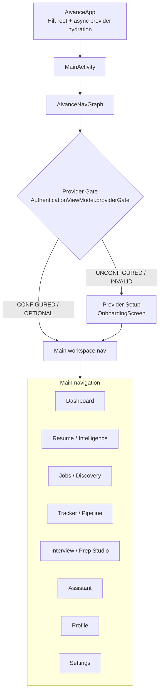
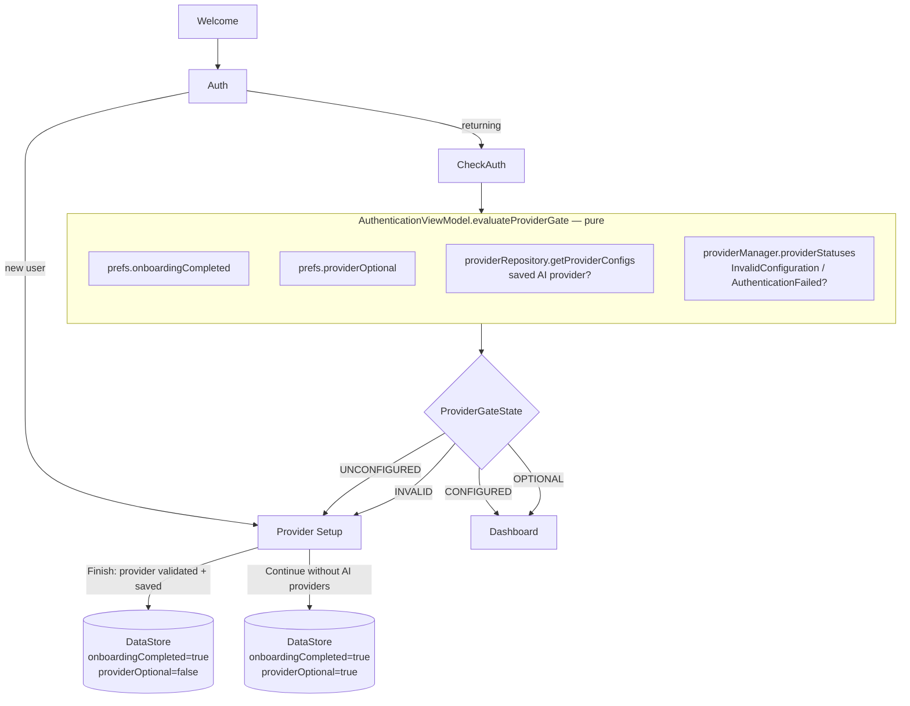

# Minimal Production Architecture — AiVance

**Status:** target reference, R2 complete. Describes the smallest wiring that keeps the *existing*
product truthful, deterministic and stable. It is a consolidation target, not a redesign: every
box below already exists in the tree; the value of the document is naming the single authoritative
owner per concern so future work does not reintroduce a second source of truth.

Guiding rule: **one responsibility → one authoritative owner → one persistence source → one state
projection.** V2 graph/event/agent infrastructure stays isolated behind its owning engine and is
never promoted to a source of truth by a consumer.

---

## 1. Application graph



## 2. Auth + provider gate (the R2.2 authority)



**Authoritative source of the gate:** `AuthenticationViewModel.evaluateProviderGate` (pure, unit
tested, 16 cases). The nav graph, the splash cold-start path (`resolveProviderGate`), and the
mid-session remediation effect all consult the same function. **No** onboarding UI flag and **no**
un-persisted runtime status can grant entry.

**"Minimum provider configuration"** was derived from the existing product contract, not invented:
provider-free mode is genuinely supported (free keyless job providers Arbeitnow/Jobicy/Adzuna/USAJobs
and the deterministic local assistant Copilot fallback), so `Skip All` stays — but only as the
*explicit, persisted* `providerOptional` choice. The bypass (`AuthViewModel` marking onboarding
complete before provider setup) is fixed: a fresh email **or** Google account now goes to provider
setup, and the persisted gate holds the line.

## 3. Dashboard state graph (the R2 hot-path fix)

```mermaid
flowchart LR
    subgraph Room[(Room — authoritative)]
        DAOs[DAOs]
    end
    DAOs --> Repos[Repositories]
    Repos --> CSE[CareerStateEngine\ncombine of 12 flows]

    CSE -->|build projection\nnever suspends| Handoff[[MutableStateFlow\nconflated handoff]]
    Handoff --> Writer[persistProjections\nDispatchers.Default]
    Writer -->|content signature changed?| CGE[CareerGraphEngine.persist]
    CGE --> Room
    Writer -->|bump| Rev[persistedRevision → CareerState.graphRevision]
    Rev --> CSE

    CSE --> VM[DashboardViewModel]
    VM --> Screen[DashboardScreen]
```

**Key invariant:** graph persistence is off the emission hot path. State emits without waiting on
the DB; the writer skips writes whose `CareerGraph.contentSignature()` is unchanged; a read-after-
write is guaranteed by carrying `graphRevision` in `CareerState`. Room stays authoritative;
`career_event_log` is never canonical; replay ownership (CAREER_EVENT provenance) and entity
projection (CareerStateEngine) remain separate.

## 4. Authoritative-source matrix

| Concern | Single owner | Persistence | Notes |
|---|---|---|---|
| Product entry / provider gate | `AuthenticationViewModel.evaluateProviderGate` | DataStore (`onboardingCompleted`, `providerOptional`) + provider configs | pure fn; splash + nav + remediation all consult it |
| Career entity graph | `CareerStateEngine` (projection) | Room `graph_nodes` / `graph_edges` | writer dedupes on content signature |
| CAREER_EVENT provenance | `CareerEventReplayEngine` | `career_event_log` (append-only) | must not mutate entity graph |
| Career Score | `CareerScoreEngine.calculateCompositeScore` | snapshot only when measured | nullable; no fabricated 75/18 |
| Skill Match | `CareerGraphEngine.analyzeSkillGaps` | derived | nullable; no 100%-from-0/0 |
| Interview Readiness | `InterviewReadinessCalculator` | derived | single owner; analytics + Prep Studio both call it |
| Saved jobs count | `JobRepository.getSavedJobs()` | Room `saved_jobs` | not the SAVED application stage |
| Upcoming interviews | interview sessions (`!isCompleted`) | Room interview tables | not `application.dateApplied` |
| AI recommendation (Dashboard hero) | `RecommendationEngine` (AI-provider-backed), persisted by weekly `AnalyticsSnapshotWorker` | Room `recommendations` table | nullable; empty table → null tip, hero falls back to a static non-claiming string |

## 5. What stays isolated (dormant V2)

`AiContextEngine2`, the agent runtime, and `HumanApprovalGate` are **not** production-wired and are
not claimed to be. `CareerEventReplayEngine` is wired only as the CAREER_EVENT provenance owner and
must never become an entity-state writer. No autonomous side-effecting agent path exists in the
product graph. These remain behind their owning engines until a real production feature consumes
them — reconnection is explicitly out of the R2/R3 scope.

## 6. Deliberately-empty contract fields (resolved)

`DashboardUiState.agentMissions` / `activeTask` (and the `AgentMission` / `AgentTask` /
`MissionStatus` model classes) were **deleted** — they were permanently empty after R3 removed their
fabricated literals, had no producer, and were never rendered. No agent producer is wired, so the
contract no longer advertises agent state it cannot supply.
