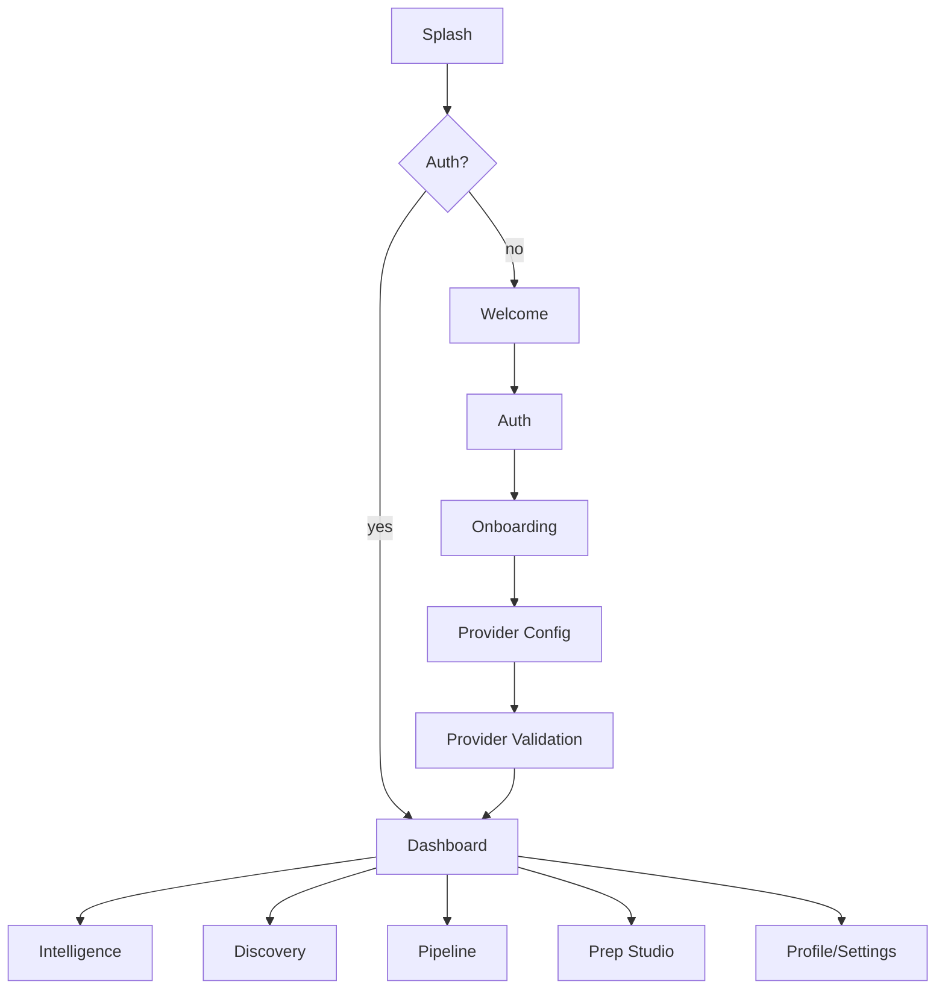
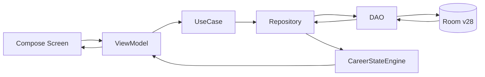
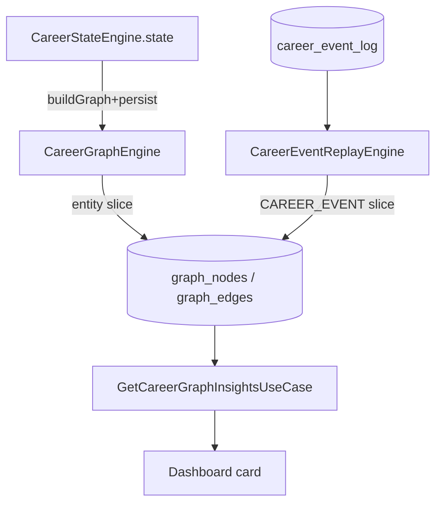
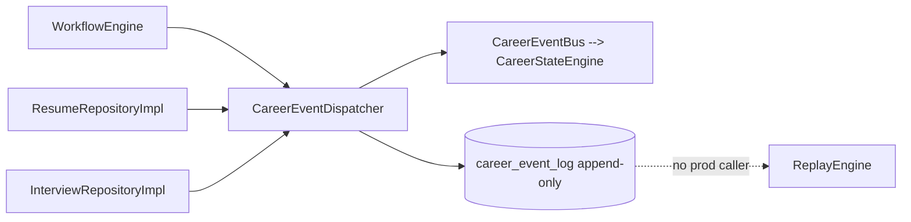
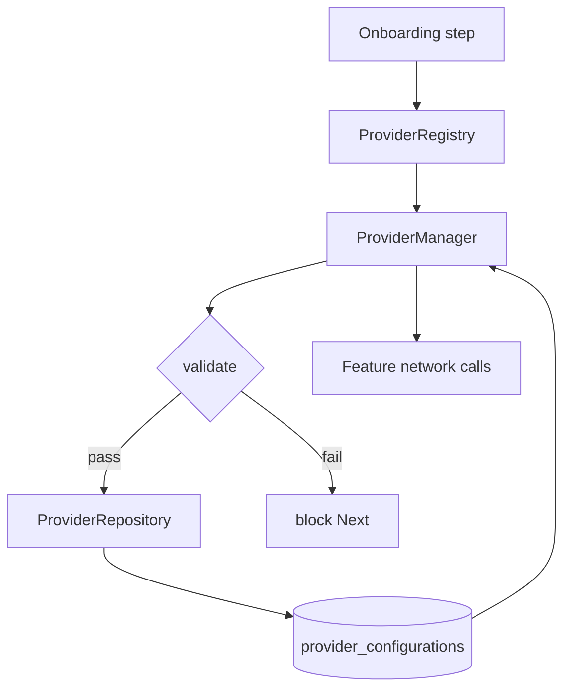

# MINIMAL STABLE ARCHITECTURE — AiVance

**Purpose:** define the smallest coherent target architecture that preserves the intended product, plus the invariant table that makes it enforceable.
**Status:** proposed target — **nothing here is implemented** (discovery gate ends at acceptance).
**Basis:** `docs/architecture/PRODUCT_TOPOLOGY_MASTER.md`.

---

## 1. Core invariant — one concept, one owner

| Concept | Authoritative owner (target) | Today |
|---|---|---|
| Authentication / session | `AuthenticationViewModel` + DataStore flag | same (works) |
| Onboarding-completed gate | `OnboardingViewModel` (single writer) | **overloaded**: also written by `AuthViewModel` |
| Provider validity gate | `ProviderManager.validateProvider` + gate contract | **no gate contract** |
| Provider configuration persistence | `ProviderRepository` (single) | **two writers** |
| Career Score | one analytics engine (live hub) | live hub w/ snapshot fallback (works, but see readiness) |
| Interview Readiness | **one** calculation owner | **two** (analytics 75 vs Prep Studio) |
| Skill Match | `CareerGraphEngine.analyzeSkillGaps`, with a real no-data state | returns 100% at 0 skills |
| Saved jobs | `saved_jobs` table via `JobDao` | application stages |
| Upcoming interview date | interview session/application interview date | `application.dateApplied` |
| Applications | `applications` table (`WorkflowDao`) | canonical (R1 done) |
| Graph entity projection | `CareerGraphEngine.persist` (single writer) | same |
| `CAREER_EVENT` slice | `CareerEventReplayEngine` (single writer) | same (dormant reader) |
| Event log | `career_event_log`, append-only via `CareerEventDispatcher` | same |
| Career memory | `CareerMemoryEngine` (deferred) | dormant |
| Agent side effects | `HumanApprovalGate` → executor | dormant, unwired |

**Rule:** if a concept has two owners, that is a defect regardless of whether the numbers currently agree.

---

## 2. Target flow (minimal stable product)

```
AUTH (local)
  → ONBOARDING
  → PROVIDER CONFIG → PROVIDER VALIDATION  (gate binds)
  → DASHBOARD
      ├── INTELLIGENCE  → Resume import/parse → ATS score → scan history
      ├── DISCOVERY     → search → job details → fit → save
      ├── PIPELINE      → application → stage → follow-up → analytics
      ├── PREP STUDIO   → mock session → score → weaknesses
      └── PROFILE/SETTINGS → providers, logout, reset
```

Only infrastructure that directly supports these flows is retained on the live path.

---

## 3. KEEP / REPAIR / CONSOLIDATE / DEFER / REMOVE

### KEEP (required and working)
- Single-Activity Nav3 shell + 5-root workspace backstacks
- `applications` as canonical (R1) + `WorkflowDao` + `ApplicationWorkflowRepository`
- `CareerStateEngine` as the single live state projection
- `CareerGraphEngine.persist` as the single entity-projection writer
- `career_event_log` append-only audit at the dispatcher boundary
- `CareerEventBus`, `CareerGraphRepository`, `GraphDao`
- 10 periodic workers + security migration
- Encrypted DataStore preferences

### REPAIR (real feature, needs correction)
- **Metric integrity** (D-01, D-02): no fabricated value at zero data; define no-data states
- **Readiness ownership** (D-03): one calculation, consumed by both Dashboard and Prep Studio
- **Saved-jobs ownership** (D-04): count `saved_jobs`
- **Interview date** (D-05): use the real interview date, not `application.dateApplied`
- **Provider gate** (D-06): enforce ≥1 validated provider before Dashboard (or explicitly define provider-optional mode)
- **Graph on hot path** (D-09): move `persist` off the reactive emission

### CONSOLIDATE
- Provider config: collapse to one repository/writer (D-11)
- Interview Readiness: collapse to one owner (D-03)
- Saved-jobs count: one owner (D-04)
- Dead state removal: `agentMissions` / `activeTask` (D-07)

### DEFER (keep, document, do not wire)
- `CareerEventReplayEngine` + rebuild use case (needs a deliberate trigger, not an implicit one)
- `CareerMemoryEngine` + repository/DAO
- `AiContextEngine2` (only after folding its token-budget/PII logic into the live context path)
- Agent tier: `CareerAgentEngine`, `HumanApprovalGate`, executor, agent use cases — **behind an approval-gated milestone only**

### REMOVE (proven unused) — later gate, with proof
- `JobComparison` route + screen (or wire it; decision required)
- 10 unused dispatcher producer methods (or wire the ones the product needs)
- `ResumeAnalysisWorker`, `NotificationWorker` (or enqueue them deliberately)

---

## 4. Diagrams (Mermaid)

### 4.1 Product journey



### 4.2 Data flow (live path)



### 4.3 Graph projection ownership



### 4.4 Event / replay pipeline



### 4.5 Provider architecture



---

## 5. Non-goals for the minimal stable product

- No autonomous agent execution (gate stays unwired).
- No event replay as a second source of truth.
- No M07 entity rehydration.
- No new tables; no unification beyond the one-context-one-owner rule.
- No redesign of the 5-root navigation shell.
